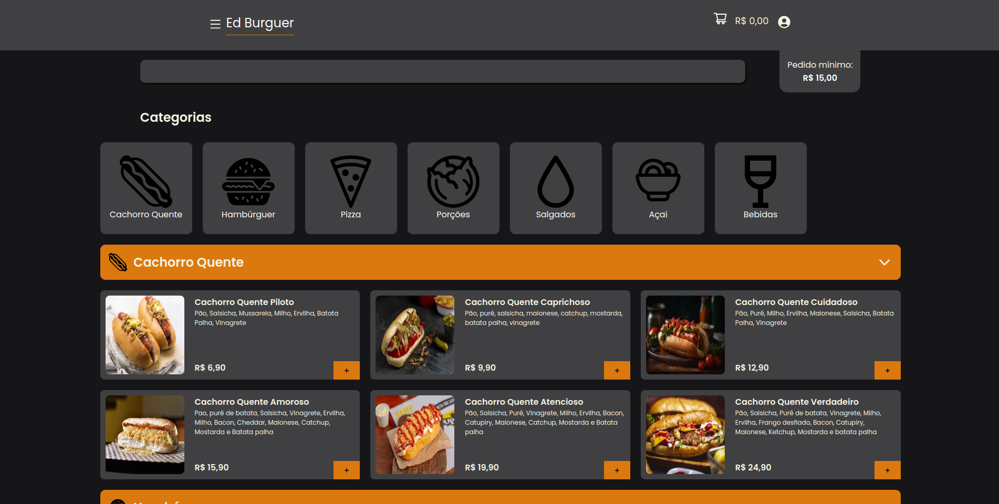

# Serviço de Delivery para pequenas lanchonetes

  

Este é um projeto pessoal que fiz do completo zero como uma forma de colocar meus conhecimentos em práticas, está sendo um processo demorado porém de muito aprendizado

## Tecnologias Utilizadas

- Frontend
  - Next
  - Stlyed-Components
  - Typescript
- Backend
  - Java
  - Spring Boot
  - Spring Data
  - Spring Security
  - JUnit5
  - Docker
  - Postgres

### Observação

- O projeto ainda está em desenvolvimento.

### Funcionalidades

- Front está quase completo, preciso realizar algumas otimizações, alguns detalhes do painel administrativo e autenticação.
- Back está pronto praticamente, muito bem estruturado com arquitetura de camadas bem definidas no padrão API Rest.
